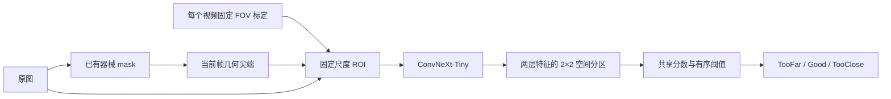

# ConvNeXt：头部 ROI、保留尺度与有序分类实验

## 已完成结果

已在 RTX 3090 上完成正式训练，第 16 轮触发早停，按验证集选择第 1 轮权重。相同的 122 张假模测试帧上，accuracy 从原 ConvNeXt 的 84.43% 降到 76.23%，macro-F1 从 75.26% 降到 63.33%，TooFar recall 从 60% 降到 40%。**本轮组合方案没有优于原模型。**

7 种颜色干预的平均概率 TV 从 0.0526 降到 0.0373，但类别翻转率从 4.57% 升到 9.60%，不能单独依据 TV 认定鲁棒性改善。新分类头的概率分布也更平缓，沿用 0.55 阈值只能接受 9/122 帧；最佳权重的 Good 概率理论上界约为 0.461，所以所有 Good 预测均无法通过该阈值。

这些结果用于保留完整的实验依据，没有按测试结果重新训练或调阈值。[详细结果与混淆矩阵](../results/convnext_head_roi_ordinal_comparison_20260907/report.md)；原图、局部输入及干预示例（本地实验产物，未随代码公开）。

## 本轮实现

这轮实验同时实现三项改动，作为一个组合方案与原 ConvNeXt 比较：

1. **限定观察区域**：复用 `realtime_improved_tip.py` 的当前帧几何尖端算法，从已有器械 mask 产生头部候选 ROI。
2. **保留尺度与局部空间信息**：ROI 边长固定为该视频有效视野直径的 0.4 倍，不跟随器械框大小变化；ConvNeXt 提取 stride 16/32 两层特征，各保留 2×2 空间分区。
3. **有序输出**：学习一个接近程度分数和两个保持先后顺序的阈值，用累积二分类损失学习 TooFar → Good → TooClose。

流程：



本轮采用局部 RGB 输入，没有整图旁路，没有使用 EndoDAC 实验 B 的分区颜色增强或一致性损失。输入图仍包含 ROI 内的背景，因此不能认为模型被严格限制为只使用器械像素。

## 头部候选区域如何确定

从每个视频按时间排序的前 8 张已有分类帧，用非黑视野边界拟合椭圆，取中心和等效直径的中位数。该视频所有样本使用固定的标定结果；这里仅使用图像的光学边界，不使用距离类别。

从已有二值 mask 中选主要连通区域，调用现有尖端提取算法。为避免稀疏抽帧造成错误的时序关联，本轮逐帧独立提取，不沿用上一帧位置，也不会把实时脚本里的 held 状态当作新观测。

窗口边长与中心为：

\[
L=\mathrm{round}(0.4D_{FOV}),\qquad c=p_{tip}-0.2L\,d.
\]

窗口先按完整边长裁切，越界部分补零，再统一缩放到 384×384。窗口大小不由器械宽度、框大小或距离标签决定，因而不会把大小不同的头部都归一化成一样大。

几何门控包括：mask 像素数、主连通区域占比、尖端几何分数、窗口在图像内的可见比例。缓存 mask 没有保存原 YOLO 检测置信度，所以几何分数不是校准过的头部定位准确概率。

### 自动审计

| 划分 | 总帧数 | 通过几何门控 | 未通过原因 |
|---|---:|---:|---|
| train | 956 | 955 | 1 张主连通区域不明确 |
| val | 175 | 174 | 1 张几何分数不足或窗口越界较多 |
| test | 122 | 122 | 无 |

训练排除 1 张不可定位帧；验证和测试保留全部帧，不可定位时记为 Invalid，并计入 accuracy、recall、macro-F1 的分母。类别权重依然由原始 956 张训练标签计算，没有随 ROI 过滤重新调整。

审查了训练集 36 张候选窗口预览，覆盖各视频与类别，以及未通过门控的样本。部分图像存在棉片夹持、强反光或器械截断。**自动可用率不是头部完整覆盖率，也不是有人工真值验证的定位准确率。** 本轮测试的是尖端引导的头部候选窗口，尚未训练专门的抓钳头部检测器。

## 网络与有序损失

ConvNeXt-Tiny 保留 stem 和四个 stage，删除原 ImageNet 分类头。384×384 ROI 的 stage 2、3 特征分别为 384×24×24 和 768×12×12。各自池化为 2×2 网格后按空间顺序展平拼接，得到 4608 维特征；通过 LayerNorm、256 维隐藏层、GELU、dropout 和线性层输出标量分数 s。

两个阈值采用共享中心、正间隔参数化：

\[
g=\operatorname{softplus}(a)+10^{-4},\quad b_0=-g/2,\quad b_1=g/2.
\]

累积概率为：

\[
q_0=\sigma(s-b_0)=P(y>0),\quad q_1=\sigma(s-b_1)=P(y>1),\quad q_0\ge q_1.
\]

标签编码：TooFar=[0,0]，Good=[1,0]，TooClose=[1,1]。训练对两个累积目标计算 BCE，使用原训练集频率产生的样本类别权重；没有额外的正负阈值重加权。

类别概率为 `[1-q0, q0-q1, q1]`，推理取这三个概率的 argmax。实现用稳定的 log-probability 公式，避免极端 logits 时中间类别的相减下溢。初始间隔设为约 2.0，确保 Good 在初始状态有非空的 argmax 区域；所有设置均在正式训练前确定。

这个设计借鉴有序回归的累积二分类思想，但使用显式有序阈值参数化，不是对 CORAL 原始实现的逐行复现。[有序回归参考](https://arxiv.org/abs/1901.07884)

阈值有序保证累积概率一致，**不保证零跨级误判，也不保证输入图像中的器械大小与输出分数严格单调**。空间特征提取方式可参见 [timm 特征提取文档](https://huggingface.co/docs/timm/en/feature_extraction)。

## 训练与对照条件

| 条件 | 本轮 |
|---|---|
| Backbone | ConvNeXt-Tiny |
| 初始化 | 本机 `convnext_tiny.in12k_ft_in1k` 预训练缓存，严格加载后去掉 ImageNet 头 |
| 是否从 A 继续训练 | 否 |
| 输入大小 | 384×384 |
| 数据划分 | 与 A 相同的 train/val/test CSV，无视频交叉 |
| Seed | 42 |
| Epoch 上限 / patience | 60 / 15 |
| Batch size | 32 |
| Backbone / head LR | 1e-5 / 3e-4 |
| 冻结 | 前 5 轮冻结 backbone |
| 类别权重 | TooFar≈1.0592，Good≈0.5685，TooClose≈1.3723 |
| 选最佳权重 | 完整验证集 macro-F1，包括定位失败的代价 |
| 测试 | 训练结束后测试最佳权重，不按测试结果换 epoch |

沿用 A 的轻微颜色、模糊和噪声增强，关闭旋转、平移、缩放和翻转，避免改变局部窗口中的有效尺度或截断头部。数据读取 workers 改为 0，用内存缓存避免重复解码，并保存 epoch 边界随机状态。

原 A checkpoint 记录的是通用 `convnext_tiny` 名称，没有完整保存预训练 revision；本轮使用当前 timm 默认标签对应的本地缓存，并记录实际文件指纹。因此不能将历史 A 与本轮比较称为所有训练细节完全一致的架构消融。

本轮同时改变 ROI、空间特征、分类头和损失，并关闭几何增强。它评估组合方案，不能据此分离三项改动的各自贡献。

## 运行命令

在仓库根目录、能够访问 GPU 的终端中运行：

```bash
PYTHON=python

$PYTHON -u distance_state_classifier/scripts/prepare_head_roi.py

$PYTHON -u distance_state_classifier/scripts/train_head_roi_ordinal.py --device cuda

MPLCONFIGDIR=/tmp/nasalendo_roi_matplotlib $PYTHON -u scripts/evaluate_convnext_head_roi_ordinal.py --device cuda
```

准备与评估目录存在时拒绝覆盖；训练目录已有权重时需要使用新目录或明确 `--resume`。

恢复训练：

```bash
$PYTHON -u distance_state_classifier/scripts/train_head_roi_ordinal.py --device cuda \
  --resume distance_state_classifier/runs/convnext_head_roi_ordinal_20260907/last.pt
```

checkpoint 保存模型、优化器、学习率调度器、AMP scaler、训练历史及随机状态。保留同一目录内的 best.pt，恢复时会核对配置与数据审计。`.training.lock` 防止同一目录并发写入；强制终止后若留下锁，需要先确认原进程已经结束。

## 文件位置

- 配置：`distance_state_classifier/configs/convnext_head_roi_ordinal.yaml`
- ROI 审计、坐标、图像指纹、训练预览：`results/convnext_head_roi_cache_20260907/`
- 新模型权重与训练记录：`distance_state_classifier/runs/convnext_head_roi_ordinal_20260907/`
- 原 ConvNeXt 对照：`distance_state_classifier/runs/final_convnext_tiny_384_v2/best.pt`
- 训练日志：`distance_state_classifier/convnext_head_roi_ordinal_20260907.log`
- 最终比较：`results/convnext_head_roi_ordinal_comparison_20260907/report.md`
- 离线推理接口：`distance_state_classifier/src/head_roi_predictor.py`

离线推理接口需要原图、器械 mask、同坐标系中已固定的 FOV 标定。该模型不能直接替代只接受整图 RGB 的旧分类器接口，当前实时控制脚本没有改动。

## 如何读结果

优先看原图 macro-F1、三类召回、跨级错误和定位可用率，再看颜色干预的预测翻转率与概率 TV。颜色诊断沿用之前的 7 种颜色干预和背景模糊压力测试；A 与新模型使用同一批图。

颜色干预时固定原始 mask、FOV 和 ROI，隔离分类器的外观敏感性。这没有测量分割器在换颜色或真实手术中的失败。

另外单独报告当前 0.55 阈值下的接受率与接受帧准确率。有序头与原 softmax 头的概率校准可能不同，主表使用阈值过滤前的预测，不用提高拒绝率来掩盖分类错误。

所有结果来自单个随机种子和假模视频；本轮没有用真实手术图像训练或验证。现有尖端位置不是人工头部真值，后续若效果受定位制约，需要补头部框或关键点标注来验证这一环节。

## 验证

```bash
$PYTHON -m unittest discover -s tests -p 'test_convnext_head_roi_ordinal.py' -v
```

11 项测试通过，覆盖：越界填充不改变尺度、视野标定、窗口不随器械尺寸变化、空 mask、有序概率归一化、极端 logits 稳定性、三个类别初始可达、类别权重与梯度、跨级损失、定位不可用帧保留在评估分母中，以及真实样本的缓存 ROI 与原图推理预处理逐像素一致。

已完成 5 批 GPU 训练预检、16 轮正式训练和原 ConvNeXt 的配对干预评估。122 张原图重新裁切后的测试混淆矩阵与训练脚本的缓存 ROI 测试结果一致；模型和定位源文件指纹与正式训练记录一致，原 ConvNeXt 权重指纹未变。
